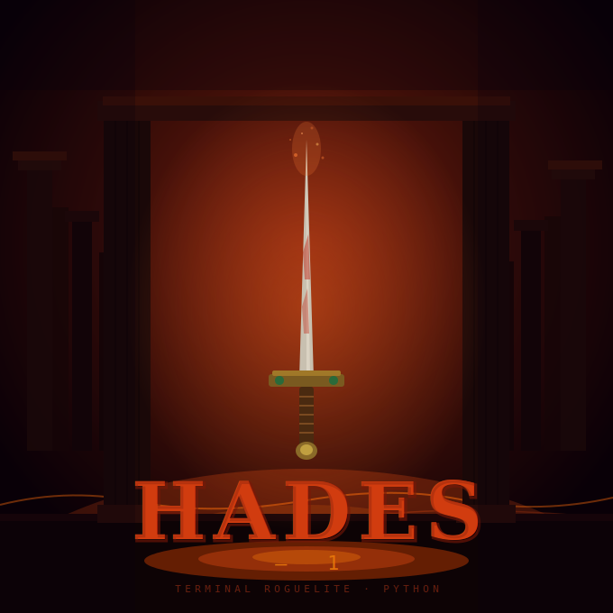

<p align="center">
  
</p>

# Hades -1

> A terminal roguelite inspired by Supergiant Games' *Hades*, built in Python with a rich terminal interface.

---

## Overview

**Hades -1** is an academic Python project that recreates the core loop of a roguelite game entirely in the terminal. You play as a hero fighting through procedurally populated rooms deep in the Underworld, collecting divine boons from the Olympian gods, and trying to survive as long as possible before death sends you back to the start.

Each run is unique: enemy count and strength scale with every room, boon drops are randomised, and the gods who offer their gifts change each time. Clearing a room restores a portion of your HP, giving you a fighting chance to push deeper. Your best runs are saved to a local leaderboard.

---

## Features

- **Roguelite run loop** — each attempt starts fresh; rooms scale in difficulty the deeper you go
- **Turn-based combat** — attack, dodge, defend, or unleash a special move every round
- **Post-room healing** — clearing a room always restores HP; boss clears restore significantly more
- **Divine boon system** — 9 Olympian gods, 4 rarity tiers, and over 100 distinct boons
- **Boss rooms** — every 10th room replaces normal enemies with a single powerful boss
- **Persistent leaderboard** — top runs are saved locally and ranked by rooms cleared
- **Rich terminal UI** — colour-coded HP bars, styled panels, and rarity-tinted boon tables powered by [Rich](https://github.com/Textualize/rich)

---

## Gameplay

### Starting a Run

When you start a new run you are prompted for a nickname. Before the first room, one of the nine Olympian gods offers you a starting boon — always Common or Rare — to give you a head start.

### Rooms

Normal rooms contain **1 to 4 enemies**. You fight them one at a time. Every room that is a multiple of 10 (Room 10, 20, 30…) is a **Boss Room** — a single enemy with power multiplied by 5 and significantly higher HP, named after the greater denizens of the Underworld.

Enemy base power scales by **+10 per room**, so every room you clear is harder than the last.

### Combat

On your turn you choose one of four actions:

| Action | Effect |
|---|---|
| ⚔️ **Attack** | Roll damage from 0 to your current POWER |
| 💨 **Dodge** | 75 % chance to completely avoid the enemy's next hit |
| 🛡️ **Defend** | Take only 50 % of the incoming damage |
| ✨ **Special** | Roll 0 – POWER × 10 damage *(requires a Legendary boon; 15-round cooldown)* |

Enemies always attack directly — no dodge, no block.

### After Each Room

After every room is cleared, two things always happen before you decide what to do next:

1. **Healing** — normal rooms restore ~14 % of your max HP; boss rooms restore ~33 %
2. **Boon offer** — 1 in 3 chance a god appears with 3 boon options to choose from

You then choose to **advance** to the next room or **retreat**, which ends your run and saves your score.

---

## The Boon System

Boons are divine gifts from the Olympian gods that permanently increase your POWER for the rest of the run.

### Rarity & Power Bonus

| Rarity | Icon | Power Bonus | Drop Chance |
|---|---|---|---|
| Common | ⚪ | +10 | 50 % |
| Rare | 🔵 | +20 | 35 % |
| Epic | 🟣 | +40 | 10 % |
| Legendary | 🌟 | +100 | 5 % |

The starting boon is always Common or Rare. Post-room boon offers use the full rarity table.

### The Gods

Each boon offer picks one god at random and shows you **3 options** from their pool. You pick one, or decline all three.

| God | Domain |
|---|---|
| **Zeus** | Lightning, electricity, storm |
| **Ares** | Curses, blood frenzy, doom |
| **Athena** | Divine shields, deflection, last stands |
| **Hermes** | Speed, evasion, quick recovery |
| **Aphrodite** | Despair, charm, broken resolve |
| **Poseidon** | Floods, waves, ocean's bounty |
| **Artemis** | Critical hits, pressure points, precision |
| **Dionysus** | Drunken effects, poison, numbing |
| **Demeter** | Frost, chill, harvest buffs |

A **Legendary boon** does two things at once: adds +100 POWER and unlocks the Special Attack, which is immediately available. After use it enters a 15-round cooldown.

---

## Project Architecture

The project enforces a strict three-layer separation. **No Rich imports exist in `entities/` or `logic/`** — this is verified automatically in the test suite.

```
hades/
├── main.py              # Menu loop — delegates to run.py and ui/screens.py
├── run.py               # Orchestrator — the only file that imports both logic/ and ui/
├── config.py            # Pure data: gods catalogue, rarity constants
│
├── entities/            # Game objects — zero external dependencies
│   ├── character.py     # Abstract base class
│   ├── player.py        # Boons, dodge, block, special attack + cooldown
│   └── enemy.py         # Direct attacker, nothing else
│
├── systems/               # Game rules — no Rich, no display code
│   ├── boons.py          # Boon class, rarity rolls, factories
│   ├── combat.py        # Spawning + turn resolution → returns dataclasses
│   └── records.py       # JSON persistence (load / save)
│
└── ui/                  # All Rich lives here, nothing else
    ├── console.py       # Single Console owner + ask(), wait(), pause()
    ├── components.py    # Reusable widgets: hp_bar, tables, panels
    └── screens.py       # Every full screen the player sees
```

### Layer rules

- `entities/` — imports only the Python standard library and `abc`
- `logic/` — imports `entities/` and `config.py`, nothing from `ui/`
- `ui/` — imports `config.py` and Rich; never calls game logic directly
- `run.py` — the single point of coordination; allowed to import from both `logic/` and `ui/`

---

## Requirements

- Python 3.10+
- [Rich](https://pypi.org/project/rich/)

---

## Installation & Usage

```bash
# Clone the repository
git clone https://github.com/your-username/hades-1.git
cd hades-1

# Install the only dependency
pip install rich

# Run the game
python main.py
```

---

## Academic Context

This project was developed as a practical exercise in object-oriented Python, covering:

- Abstract base classes with `abc.ABC` and `@abstractmethod`
- Inheritance and polymorphism (`Player` and `Enemy` both extend `Character`)
- Separation of concerns across a multi-layer architecture
- Data classes as typed return values from pure functions
- JSON-based persistence
- Terminal UI design with the Rich library

---

## Inspiration

Mechanically inspired by [Hades](https://www.supergiantgames.com/games/hades/) by Supergiant Games. All god names, boon names, and enemy names are references to the original game and belong to their respective owners. This project is non-commercial and for educational purposes only.